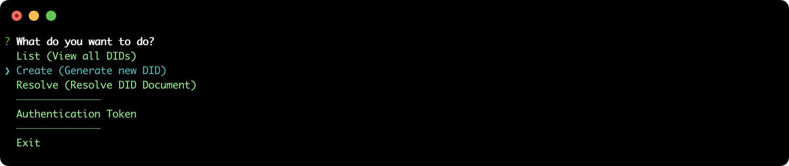
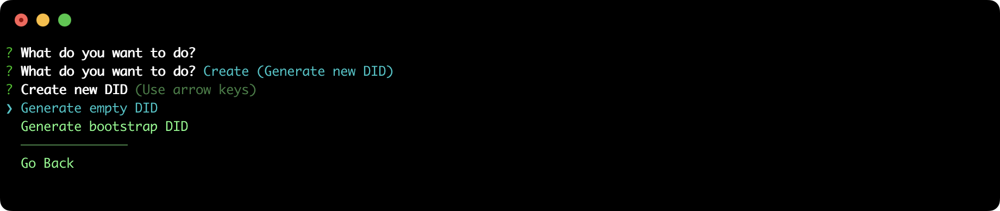
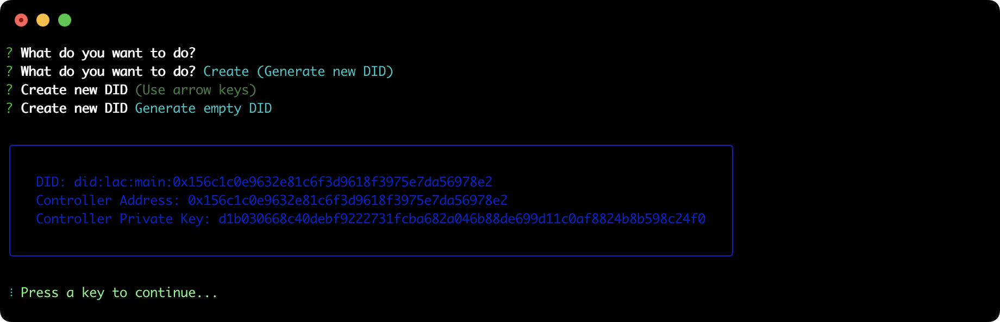
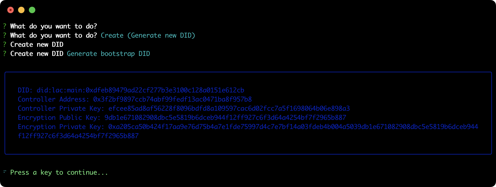
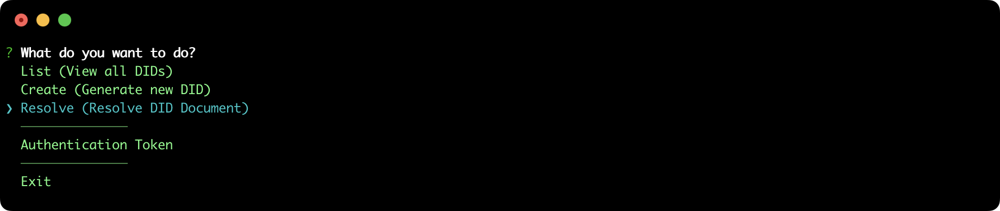
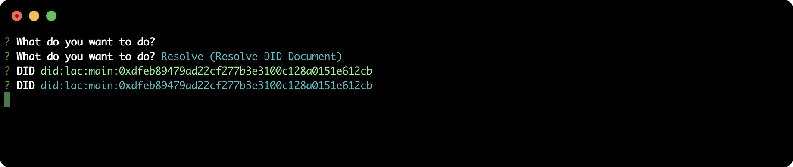
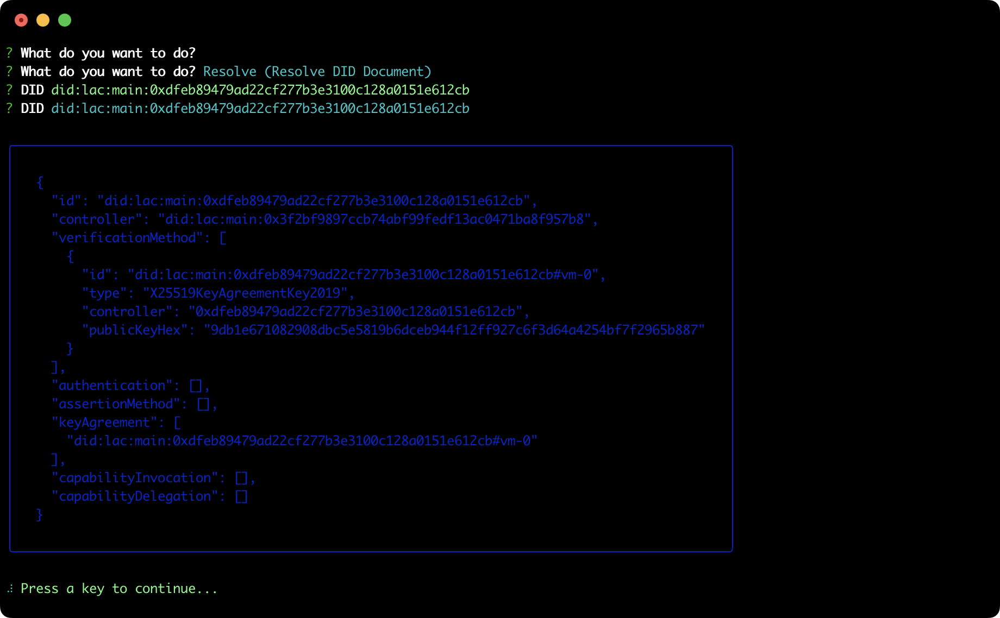

## Generate DID

This tutorial describes the steps to generate a new LACChain DID using the command line tool (did-cli).

### Pre-requisites

- **did-cli**: to see how to install and run the CLI tool go to the official repository: https://github.com/lacchain/did-cli

### Create a new DID

Once you have the tool running, select the **Create (Generate new DID)** option on the interactive menu.

There are two ways to create a DID:
     1. **Empty DID**: this option will create a new empty DID (ie without any Verification Method), simply generating an Ethereum key pair
     2. **Bootstrap DID**: this option will create a DID with a Verification Method to encrypt data (keyAgreement) generating a pair of keys using the NaCL algorithm, the latter with the purpose of being used to send Verifiable Credentials using the LACChain Mail box. Finally, it will create a new controller (Ethereum key pair) and assign it to the created DID for greater security.
     

If you select the first option, only the main public-private key pair will be displayed:

If you select the second option, the current controller key-pair will be displayed along with the encryption keys:

### Resolve DID Document

Once the DID has been created, it is possible to resolve the DID Document from the same tool, selecting the option **Resolve DID**:

Then, you need to enter the DID and press Enter:

The DID Document will be resolved and displayed in the console:

