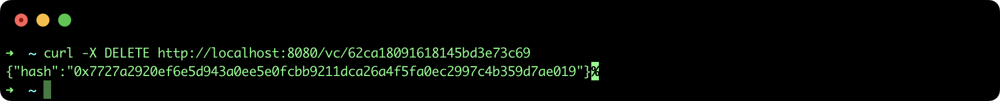
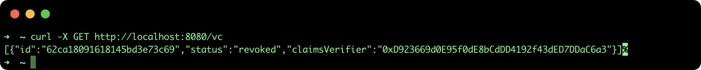

## Revoke a Verifiable Credential

This tutorial describes the steps to revoke a Verifiable Credential using the [SSI API](https://github.com/lacchain/ssi-api).

### Pre-requisites

- **ssi-api**: to see how to install and run the REST API go to the official repository: https://github.com/lacchain/ssi-api

**Note**: This tutorial assumes that you have the API running at http://localhost:8080.

### Revoke a VC

**Important note**: Only the issuer can revoke the VC, that means, you need to use the issuer account address and private key to configure the SSI API.

If you want to revoke an issued VC it is necessary to know the **Claims Verifier address** and the **id** of the credential. To perform the operation execute the next command:

```bash
curl -X DELETE http://localhost:8080/vc/62ca18091618145bd3e73c69
```

This command will return only the blockchain transaction hash, as it is show in the next image:



To confirm the revocation process, execute the next command:

```bash
curl -X GET http://localhost:8080/vc
```

This command will return an array of VC with the **status: "revoked"** of the revoked entity, as it is show in the next image:


