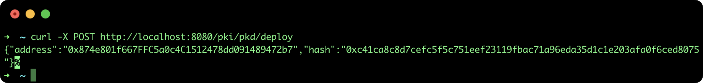
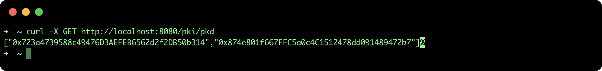

## Create regional Public Key Directory

This tutorial describes the steps to deploy a regional Public Key Directory (PKD) smart contract in order to build a Root of Trust using [SSI API](https://github.com/lacchain/ssi-api).

### Pre-requisites

- **ssi-api**: to see how to install and run the REST API go to the official repository: https://github.com/lacchain/ssi-api

**Note**: This tutorial assumes that you have the API running at http://localhost:8080.

### Deploy a new PKD

To deploy a new PKD smart contract, execute the following command:

```bash
curl -X POST http://localhost:8080/pki/pkd/deploy
```

This command will return the PKD address and blockchain transaction hash, as it is show in the next image:



### List deployed PKDs

To view the list of all PKDs deployed, execute the next command:

```bash
curl -X GET http://localhost:8080/pki/pkd
```

This command will return the PKD address and blockchain transaction hash, as it is show in the next image:


