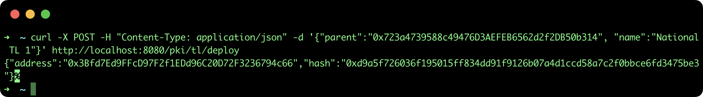
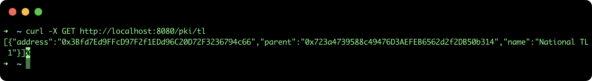

## Create national Trusted List

This tutorial describes the steps to deploy a regional Public Key Directory (PKD) smart contract in order to build a Root of Trust using the [SSI API](https://github.com/lacchain/ssi-api).

### Pre-requisites

- **ssi-api**: to see how to install and run the REST API go to the official repository: https://github.com/lacchain/ssi-api

**Note**: This tutorial assumes that you have the API running at http://localhost:8080.

### Deploy a new TL

To deploy a new Trusted List smart contract you need to specify the **parent TL or PKD address** and the new **TL name**, if you don't have or don't want to specify a parent element just use the Ethereum zero address (0x0000000000000000000000000000000000000000). To create the TL execute the next command:

```shell
curl -X POST -H "Content-Type: application/json" -d '{"parent":"0x723a4739588c49476D3AEFEB6562d2f2DB50b314", "name":"National TL 1"}' http://localhost:8080/pki/tl/deploy
```

This command will return the TL address and blockchain transaction hash, as it is show in the next image:



Now that you have deployed the TL and linked to another TL or PKD by it parent property, it is necessary to link reversely in the parent element by [Register a TL in a PKD](./5.%20Register%20a%20TL%20in%20a%20PKD.md).

### List deployed TLs

To view the list of all TLs deployed, execute the next command:

```bash
curl -X GET http://localhost:8080/pki/tl
```

This command will return an array of TL with: **name**, **address** and **parent TL or PKD address**, as it is show in the next image:


