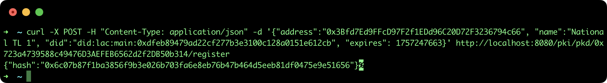
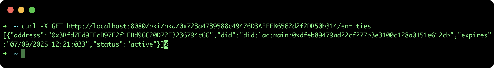

## Register a national Trusted List in a regional PKD

This tutorial describes the steps to register a national TL in a regional Public Key Directory (PKD) in order to build a Root of Trust using the [SSI API](https://github.com/lacchain/ssi-api).

### Pre-requisites

- **ssi-api**: to see how to install and run the REST API go to the official repository: https://github.com/lacchain/ssi-api

**Note**: This tutorial assumes that you have the API running at http://localhost:8080.

### Register a TL in a PKD

**Important note**: Only the owner of PKD (who has deployed the smart contract) can register entities (or TL). That means, you need to use the same account address and private key to configure the SSI API.

Once you already have a Trusted List deployed and pointing to a PKD, it is necessary to register the new TL in the parent PKD, to do that you need to specify the **PKD address** as url parameter, and the following entity information in the body of request:

- **address**: The Trusted List address (0x3Bfd7Ed9FFcD97F2f1EDd96C20D72F3236794c66)
- **name**: The entity name behind the TL
- **did**: The entity DID, who has the public keys and x509 certificates (did:lac:main:0xdfeb89479ad22cf277b3e3100c128a0151e612cb). Usually, it's the same as owner address (deployer of smart contract), but can be different.
- **expires**: The expiration date in UNIX timestamp-seconds (1757247663 -> Sun Sep 07 2025 12:21:03 GMT+0000)
To create the TL execute the next command:

```bash
curl -X POST -H "Content-Type: application/json" -d '{"address":"0x3Bfd7Ed9FFcD97F2f1EDd96C20D72F3236794c66", "name":"National TL 1", "did":"did:lac:main:0xdfeb89479ad22cf277b3e3100c128a0151e612cb", "expires": 1757247663}' http://localhost:8080/pki/pkd/0x723a4739588c49476D3AEFEB6562d2f2DB50b314/register
```

This command will return only the blockchain transaction hash, as it is show in the next image:



This process complete the bidirectional link between a national Trusted List and a regional Public Key Directory.

### List entities in PKD

To view the list of all entities (TLs and regular entities) registered in the PKD (0x723a4739588c49476D3AEFEB6562d2f2DB50b314), execute the next command:

```bash
curl -X GET http://localhost:8080/pki/pkd/0x723a4739588c49476D3AEFEB6562d2f2DB50b314/entities
```

This command will return an array of entities with: **address**, **did**, **expiration date** and **status** (active|revoked), as it is show in the next image:


