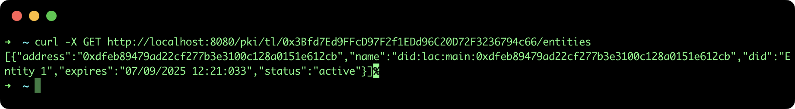

## Register an Entity in a Trusted List

This tutorial describes the steps to register an Entity in a Trusted List (TL) in order to build a Root of Trust using the [SSI API](https://github.com/lacchain/ssi-api).

### Pre-requisites

- **ssi-api**: to see how to install and run the REST API go to the official repository: https://github.com/lacchain/ssi-api

**Note**: This tutorial assumes that you have the API running at http://localhost:8080.

### Register an Entity in a TL

**Important note**: Only the owner of TL (who has deployed the smart contract) can register entities (or Sub-TL). That means, you need to use the same account address and private key to configure the SSI API.

To register an Entity in a Trusted List it is necessary to specify the **TL address** as url parameter, and the following entity information in the body of request:

- **address**: The entity address. Usually the same as the DID, but it could be different if the entity is a sub Trusted List, in this case the address here corresponds to the Sub-TL address. (0xdfeb89479ad22cf277b3e3100c128a0151e612cb)
- **name**: The entity name
- **did**: The entity DID, who has the public keys and x509 certificates (did:lac:main:0xdfeb89479ad22cf277b3e3100c128a0151e612cb). This DID commonly corresponds to an Isuser of Verifiable Credentials.
- **expires**: The expiration date in UNIX timestamp-seconds (1757247663 -> Sun Sep 07 2025 12:21:03 GMT+0000)
To create the TL execute the next command:

```bash
curl -X POST -H "Content-Type: application/json" -d '{"address":"0xdfeb89479ad22cf277b3e3100c128a0151e612cb", "name":"Entity 1", "did":"did:lac:main:0xdfeb89479ad22cf277b3e3100c128a0151e612cb", "expires": 1757247663}' http://localhost:8080/pki/tl/0x3Bfd7Ed9FFcD97F2f1EDd96C20D72F3236794c66/register
```

This command will return only the blockchain transaction hash, as it is show in the next image:


### List entities in TL

To view the list of all entities (regular entities and sub-TL) registered in the TL (0x723a4739588c49476D3AEFEB6562d2f2DB50b314), execute the next command:

```bash
curl -X GET http://localhost:8080/pki/tl/0x3Bfd7Ed9FFcD97F2f1EDd96C20D72F3236794c66/entities
```

This command will return an array of entities with: **address**, **name**, **did**, **expiration date** and **status** (active|revoked), as it is show in the next image:


