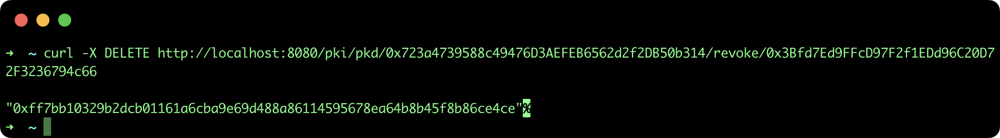
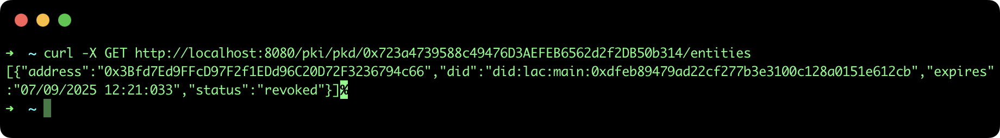

## Revoke a national Trusted List in a regional PKD

This tutorial describes the steps to revoke a national TL registered in a regional Public Key Directory (PKD) using the [SSI API](https://github.com/lacchain/ssi-api).

### Pre-requisites

- **ssi-api**: to see how to install and run the REST API go to the official repository: https://github.com/lacchain/ssi-api

**Note**: This tutorial assumes that you have the API running at http://localhost:8080.

### Revoke a TL in a PKD

**Important note**: Only the owner of PKD (who has deployed the smart contract) can revoke entities (or TL). That means, you need to use the same account address and private key to configure the SSI API.

If you want to revoke a Trusted List registered in a PKD, it is only necessary to provide the **PKD address** and the **TL address** (in the same order) in the url request, as it is show in the following snippet:

```bash
curl -X DELETE http://localhost:8080/pki/pkd/0x723a4739588c49476D3AEFEB6562d2f2DB50b314/revoke/0x3Bfd7Ed9FFcD97F2f1EDd96C20D72F3236794c66
```

This command will return only the blockchain transaction hash, as it is show in the next image:



To confirm the revocation process, execute the next command:

```bash
curl -X GET http://localhost:8080/pki/pkd/0x723a4739588c49476D3AEFEB6562d2f2DB50b314/entities
```

This command will return an array of entities with the **status: "revoked"** of the previous entity, as it is show in the next image:


