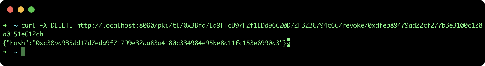
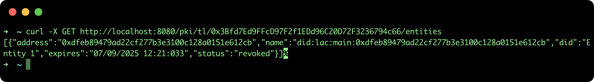

## Revoke a Entity in a Trusted List

This tutorial describes the steps to revoke an Entity registered in a regional Trusted List (TL) using the [SSI API](https://github.com/lacchain/ssi-api).

### Pre-requisites

- **ssi-api**: to see how to install and run the REST API go to the official repository: https://github.com/lacchain/ssi-api

**Note**: This tutorial assumes that you have the API running at http://localhost:8080.

### Revoke an Entity in a TL

**Important note**: Only the owner of TL (who has deployed the smart contract) can revoke entities (or Sub-TL). That means, you need to use the same account address and private key to configure the SSI API.

If you want to revoke an Entity or Sub-TL registered in a TL, it is only necessary to provide the **TL address** and the **Entity address** (in the same order) in the url request, as it is show in the following snippet:

```bash
curl -X DELETE http://localhost:8080/pki/tl/0x3Bfd7Ed9FFcD97F2f1EDd96C20D72F3236794c66/revoke/0xdfeb89479ad22cf277b3e3100c128a0151e612cb
```

This command will return only the blockchain transaction hash, as it is show in the next image:



To confirm the revocation process, execute the next command:

```bash
curl -X GET http://localhost:8080/pki/tl/0x3Bfd7Ed9FFcD97F2f1EDd96C20D72F3236794c66/entities
```

This command will return an array of entities with the **status: "revoked"** of the previous entity, as it is show in the next image:


