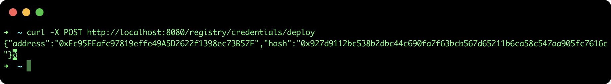
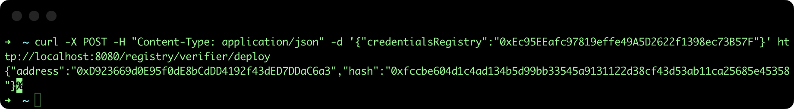
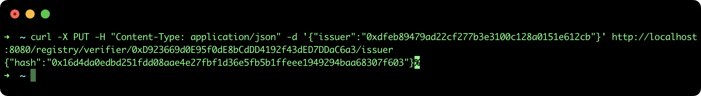
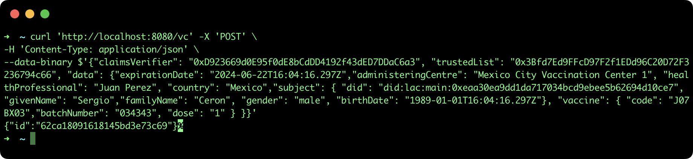
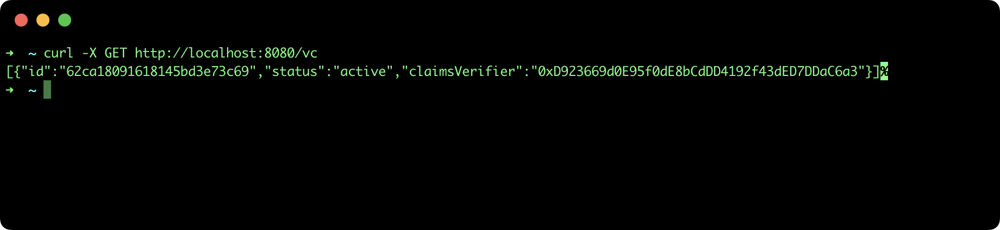
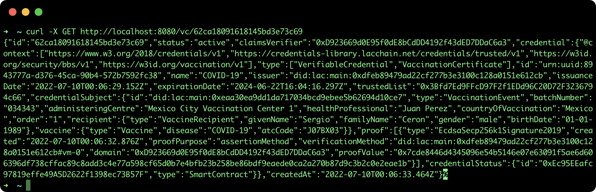

## Issue a Verifiable Credential

This tutorial describes the steps to issua a Verifiable Credential (VC) using the LACChain Credential Registry as a blockchain repositoy for decentralized verification, using the [SSI API](https://github.com/lacchain/ssi-api).

### Pre-requisites

- **ssi-api**: to see how to install and run the REST API go to the official repository: https://github.com/lacchain/ssi-api

**Note**: This tutorial assumes that you have the API running at http://localhost:8080.

### 1. Deploy Credential Registry

*If you already have a Credential Registry smart contract deployed, skip this section.*

The Credential Registry is a smart contract that store the hash of VCs in order to allow blockchain verification(find more information check [LACChain Verifiable Credentials](https://github.com/lacchain/vc-contracts)) and it's a required component to issue a VC. To deploy a new Credential Registry smart contract, call the following API method:

```bash
curl -X POST http://localhost:8080/registry/credentials/deploy
```

This command will return the Credentials Registry address (**0xEc95EEafc97819effe49A5D2622f1398ec73B57F**) and the blockchain transaction hash, as it is show in the next image:



### 2. Deploy Claims Verifier

*If you already have a Claims Verifier smart contract deployed, skip this section.*

Another important smart contract is the Claims Verifier, which is the component responsible of registering the credential hashes and verifying them by making internal calls to the **Credential Registry**. To deploy a new Claims Verifier smart contract you need to pass the Credential Registry address (**0xEc95EEafc97819effe49A5D2622f1398ec73B57F**) as a body parameter:

```bash
curl -X POST -H "Content-Type: application/json" -d '{"credentialsRegistry":"0xEc95EEafc97819effe49A5D2622f1398ec73B57F"}' http://localhost:8080/registry/verifier/deploy
```

This command will return the Claims Verifier address (**0xD923669d0E95f0dE8bCdDD4192f43dED7DDaC6a3**) and the blockchain transaction hash, as it is show in the next image:



The Claims Verifier address will be used as a parameter to issue new Verifiable Credential.

### Register an Issuer

Before issuing a new Verifiable Credential, it's required to grant the permissions to the issuer address in the Claims Verifier. For grant role to an issuer, just call the next API method, passing the Claims Verifier address (**0xD923669d0E95f0dE8bCdDD4192f43dED7DDaC6a3**) in the url and the issuer address in the body (**0xdfeb89479ad22cf277b3e3100c128a0151e612cb**).

**Note**: the issuer of a VC is the **msg.sender** in the smart contract, so it must be the same as **account** configured in the SSI API.

```bash
curl -X PUT -H "Content-Type: application/json" -d '{"issuer":"0xdfeb89479ad22cf277b3e3100c128a0151e612cb"}' http://localhost:8080/registry/verifier/0xD923669d0E95f0dE8bCdDD4192f43dED7DDaC6a3/issuer
```

This command will return only the blockchain transaction hash, as it is show in the next image:



### Issue VC

The SSI API allows only to issue Health Vaccination Credential, so it's necessary to have all the information about the subject and vaccination data. Also, the **Claims Verifier address** and optionally a **Trusted List address**:

```bash
curl 'http://localhost:8080/vc' -X 'POST' \
-H 'Content-Type: application/json' \
--data-binary $'{"claimsVerifier": "0xD923669d0E95f0dE8bCdDD4192f43dED7DDaC6a3", "trustedList": "0x3Bfd7Ed9FFcD97F2f1EDd96C20D72F3236794c66", "data": {"expirationDate": "2024-06-22T16:04:16.297Z","administeringCentre": "Mexico City Vaccination Center 1", "healthProfessional": "Juan Perez", "country": "Mexico","subject": { "did": "did:lac:main:0xeaa30ea9dd1da717034bcd9ebee5b62694d10ce7", "givenName": "Sergio","familyName": "Ceron", "gender": "male", "birthDate": "1989-01-01T16:04:16.297Z"}, "vaccine": { "code": "J07BX03","batchNumber": "034343", "dose": "1" } }}'
```

Note: The **data** field corresponds to the **credentialSubject** of Vaccination Credential.

The result of the execution will send the VC to the **subject.did** using the [LACChain Mailbox](https://github.com/lacchain/mailbox) and returns the **id** of the VC (useful for revocation process).



### List of issued VC

To view the list of all VC issued, execute the next command:

```bash
curl -X GET http://localhost:8080/vc
```

This command will return an array of TL with only: **id**, **claimsVerifier** and **status**(active|revoked)  fields, as it is show in the next image:



if you want the full VC, call the following method:

```bash
curl -X GET http://localhost:8080/vc/62ca18091618145bd3e73c69
```

This command will return the full JSON of a VC, useful to share and verify externally.



